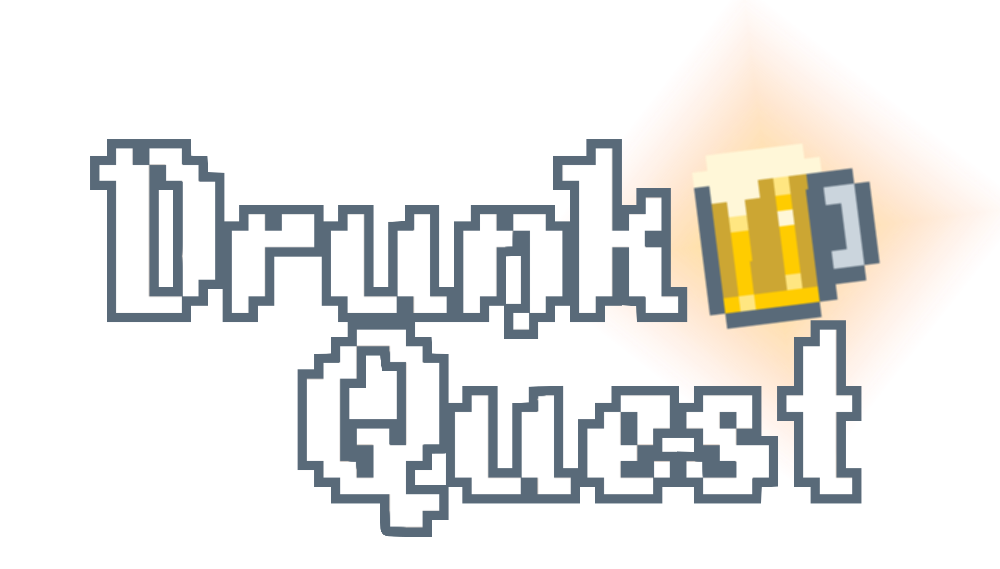

<h1 align="center">
 
   
 
</h1>

 
  
  
  
  
  
  
A equipe **Call from Beyond** está trabalhando atualmente no jogo de RPG de aventura em plataforma Drunk Quest, onde você joga como **Bill Boêmio**, um simples faxineiro em uma pequena taverna de sua vila que recebe um chamado para aventura quando um forasteiro desconhecido entra na taverna falando a respeito de uma bebida mágica e lendária: O Hidromel dos Deuses.

  

