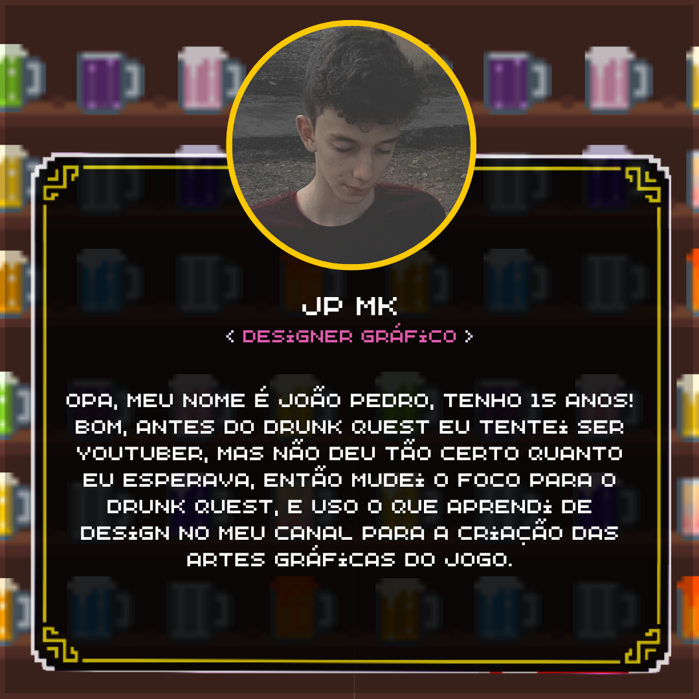
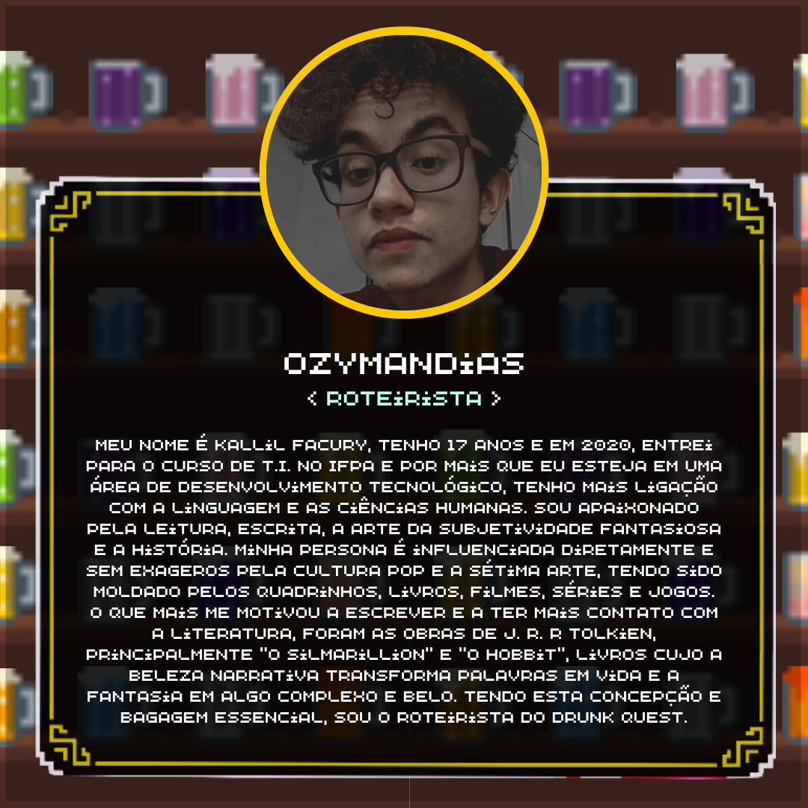
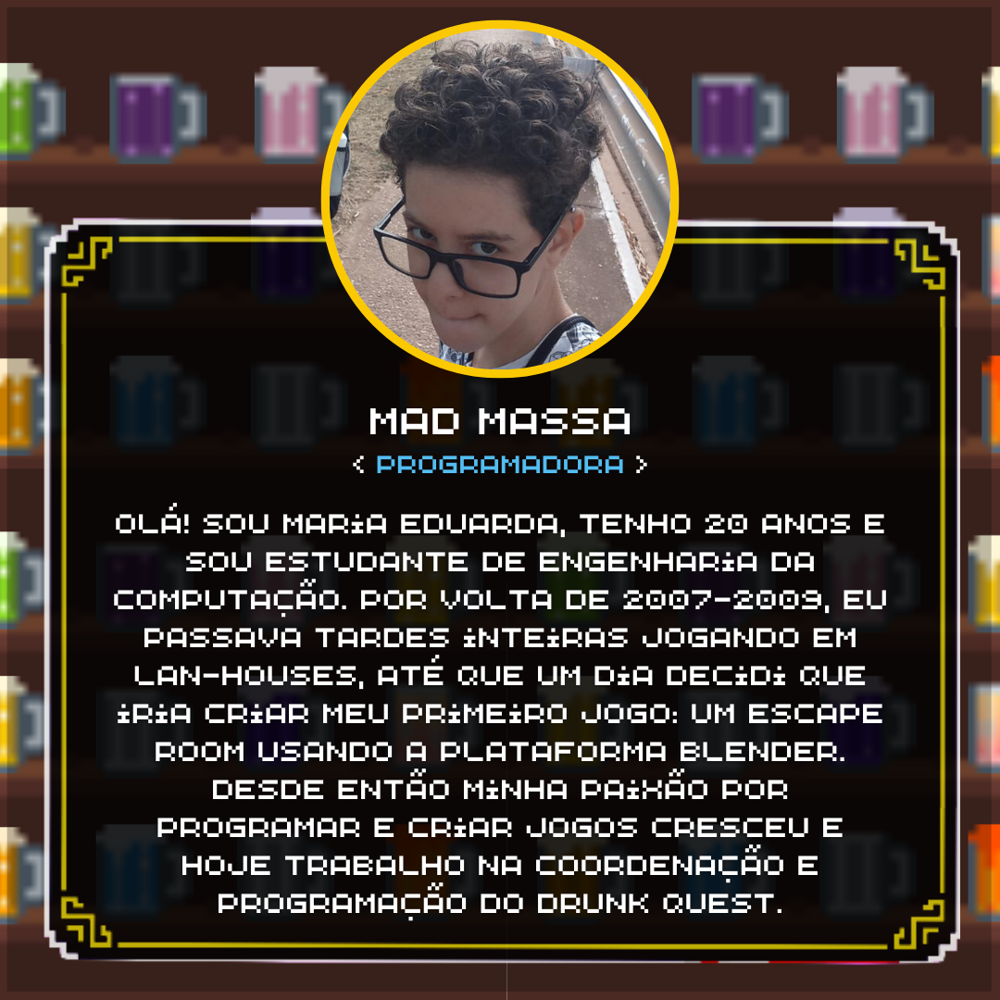
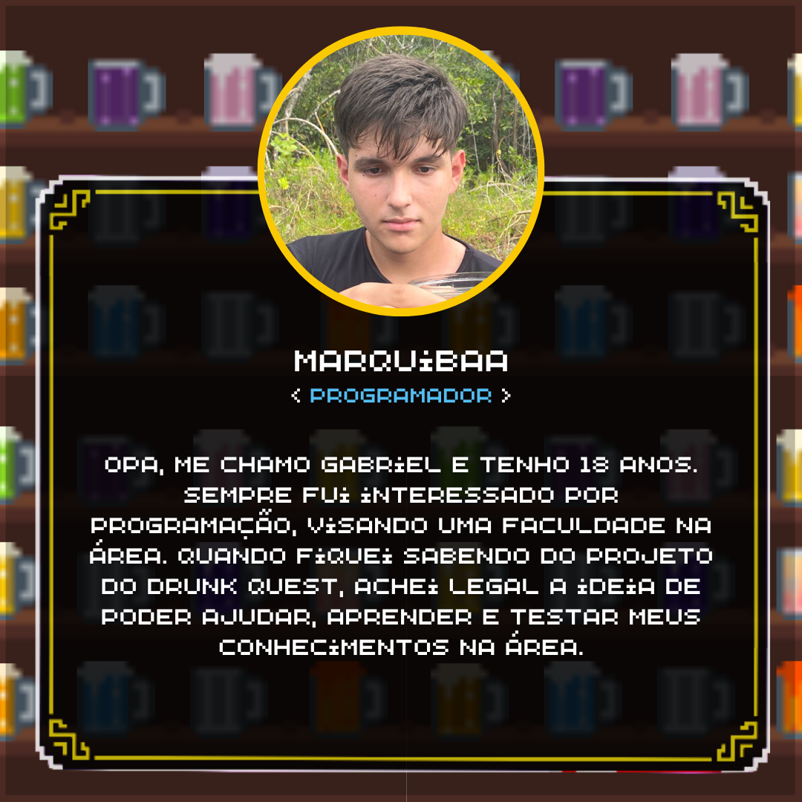
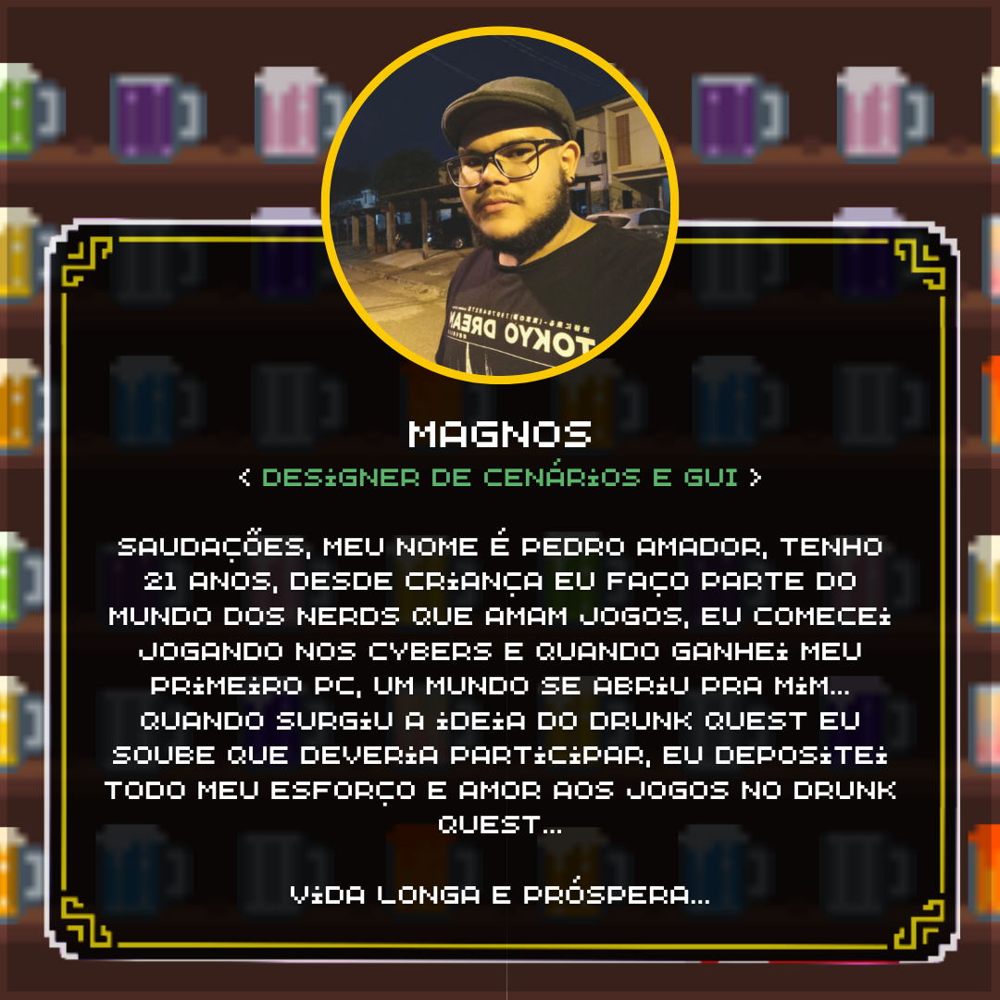
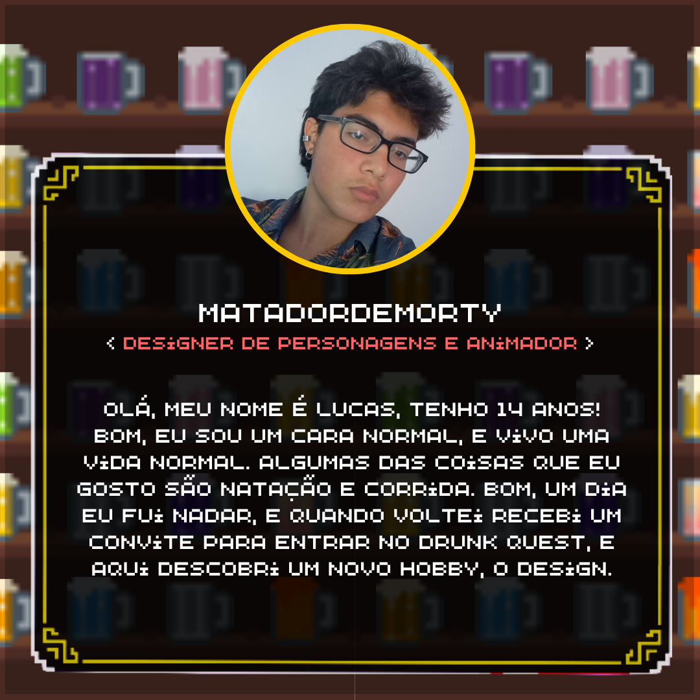
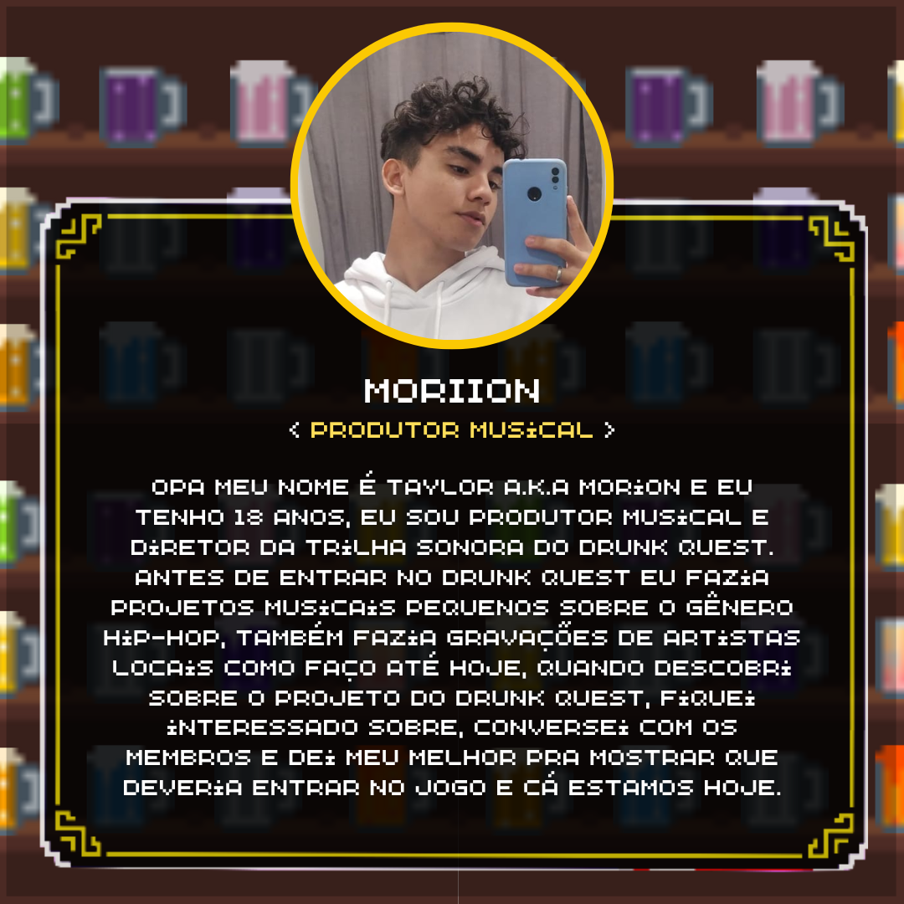

<div align="center">
   
   <h1>
   </h1>
</div>

<div align="center">
A equipe <b>Call from Beyond</b> está trabalhando atualmente no jogo de RPG de aventura em plataforma Drunk Quest, onde você joga como <b>Bill Boêmio</b>, um simples faxineiro em uma pequena taverna de sua vila que recebe um chamado para aventura quando um forasteiro desconhecido entra na taverna falando a respeito de uma bebida mágica e lendária: O Hidromel dos Deuses
</div>

### 🚀 Ajustes e melhorias

O projeto ainda está em desenvolvimento e as próximas atualizações serão voltadas nas seguintes tarefas:

- [ ] Inventário intuitivo
- [ ] Sistema de compra de itens nas tavernas
- [ ] Sidequests


## 💻 Pré-requisitos

Antes de começar, verifique se você atendeu aos seguintes requisitos:
* Você instalou a versão mais recente de `.NET Framework, DirectX`
* Você tem uma máquina `<Windows / Linux>`.

## ☕ Instalando Drunk Quest

Para instalar Drunk Quest, siga estas etapas:


Para Linux, instale o Wine em seu sistema antes de rodar o executável de instalação.

No Archlinux: 
```
sudo pacman -S wine
```

No Ubuntu: 
```
sudo apt updatesudo apt install wine
```

Windows:
```
Clique duas vezes no executável de instalação e siga o passo-a-passo proposto.
```

## 👾 Jogando Drunk Quest

Para jogar Drunk Quest siga estas etapas:

* Leia com atenção todas as instruções presentes na fase inicial do jogo.
* Leia as conversas entre seu personagem e NPCs para entender melhor o progresso da narrativa.
* Prossiga de taverna em taverna, fale com NPCs, lute com outros bêbados e complete as missões até chegar no final.

## 🤝 Colaboradores
Agradecemos às seguintes pessoas que contribuíram para este projeto:



## 📝 Licença

Esse projeto está sob licença. Veja o arquivo [LICENÇA](LICENSE.md) para mais detalhes.

[⬆ Voltar ao topo](#drunkquest)<br>
